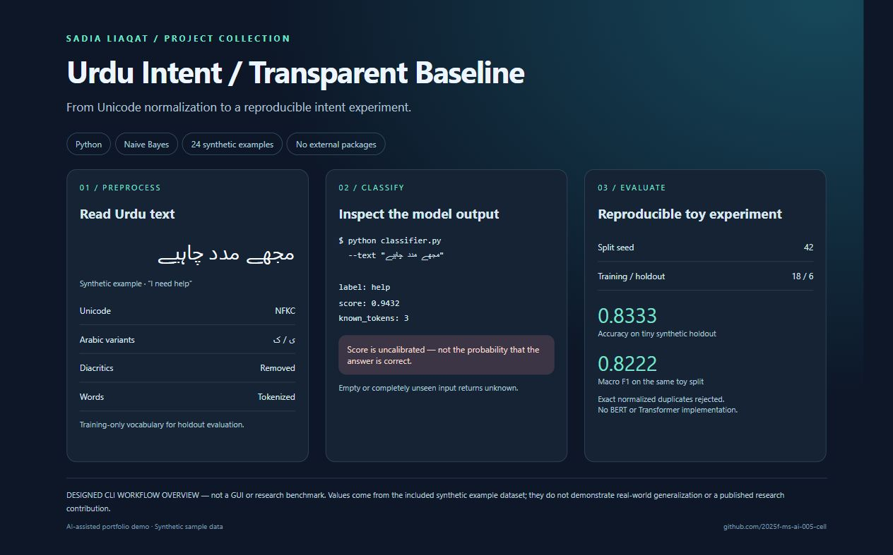

# Urdu Intent Baseline

A dependency-free **multinomial Naive Bayes** classifier demonstrating Urdu normalization, tokenization, stratified holdout evaluation and explicit unknown-input handling. AI-assisted portfolio/learning code prepared for Sadia Liaqat. **Not a paper, original research contribution or validated production model.**

## Visual overview



Designed workflow illustration for the runnable Python CLI; **not a graphical application**. Shows normalization, classification and holdout evaluation on synthetic data. The model score is not calibrated confidence, and evaluation is not a research benchmark.

## Run the demo

Python 3.10+; no third-party packages required.

```sh
python -m unittest -v
python classifier.py
python classifier.py --text "مجھے مدد چاہیے"
```

Default evaluation uses a reproducible seed (42), 25% per-class holdout, training-only vocabulary, Laplace smoothing, accuracy, macro F1 and a confusion matrix. Duplicate normalized input is rejected to prevent exact-text split leakage. Prediction fits on all provided rows; its score is an **uncalibrated softmax-normalized model score**, not a probability of correctness. Empty or entirely unseen text returns `unknown`.

## Data transparency

`sample_data.csv` has 24 **hand-authored synthetic demo sentences** across greeting, help and problem labels. It contains no collected user conversations. Tiny synthetic data cannot establish real-world generalization, statistical significance or superiority over other methods. Keep near-duplicate/paraphrase groups together when replacing it with real data; exact-duplicate checking alone cannot prevent semantic leakage.

## Bring your own data

Supply UTF-8 CSV with `text,label` columns using `--data path.csv`; minimum four distinct sentences per class, two classes. Use data you are authorized to process, document its source/license, remove personal information, reserve a genuinely independent test set, and avoid repeated tuning on that test set.

## Limitations and next experiments

No Transformers, pretrained models, morphology, negation modeling or Roman Urdu support. Word overlap controls predictions; dialects and spelling changes may fail. This baseline is intended as a transparent starting point before a separately sourced TF-IDF/SVM or BERT comparison on a suitable licensed dataset. No benchmark scores are claimed in this README.

Tests: normalization, unknown handling, reproducible/disjoint split, metrics and invalid training input. See `VERIFICATION.md` for executed checks.

[Sadia’s LinkedIn](https://www.linkedin.com/in/sadia-liaqat-493998398/)

